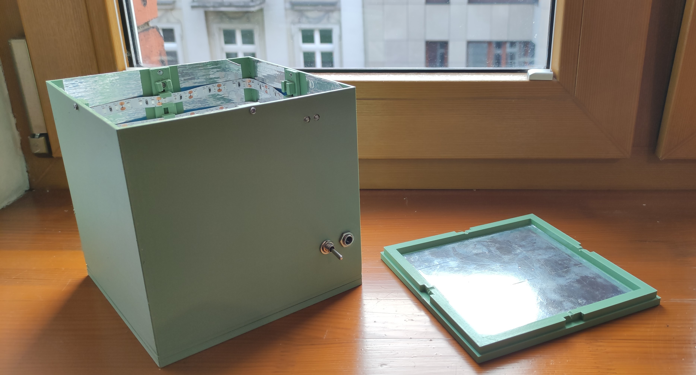
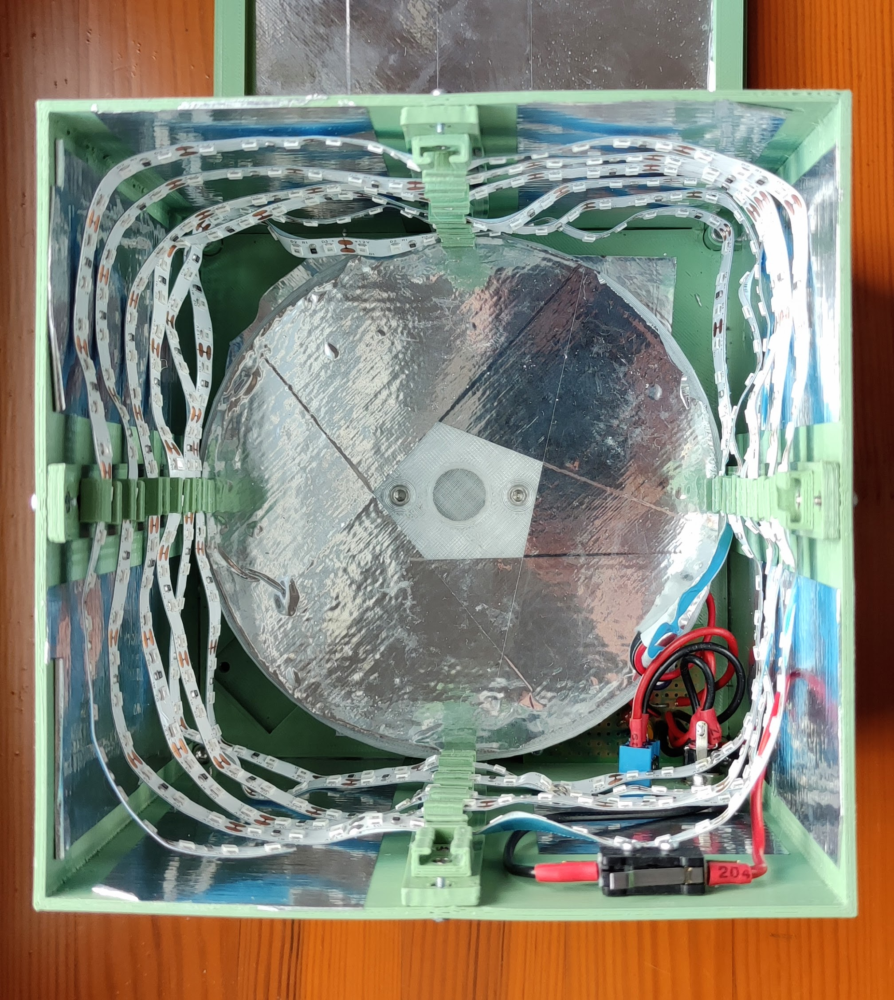

# Resin Curing Chamber
Parametrized DYI resin curing chamber, using UV LED strips.

Features:
  * simplicity - no moving parts and a short BOM of commodity electronics
  * fully customizable - build it as small, or as large as you wish, with the
    parts available to you
  * safe to operate - doesn't turn on unless the cover is closed, designed with
    protecting against light leaks in mind

| Front | Inside |
|:-----:|:------:|
|  |  |

## Build manual
See the [build manual document](./docs/build-manual.md) for BOM and instructions.

## Motivations
There is a bunch of DYI resin curing chamber projects out there, and with better
features. Why build another?

Initially I had intended for this project to have a turn-table based on a tiny
hobby DC motor with a reduction gearbox, therefore catching up on the feature set.

However, this was increasing the complexity a lot, causing me a lot of grief
as the engine I'd used was very underpowered, and, as I soon noticed, didn't have
much impact on the curing quality, probably due to the light source being all
around the part, and not in a single place, as in some other projects.

Additionally, the build volume of my printer is tiny, so I didn't really need
the size the other projects were offering out of the box. Instead, I wanted
something I could scale up while keeping the innards intact if I wanted to.

The goal for a next version is to revisit the turn-table concept, as well as add
in some form of a timer and display.
